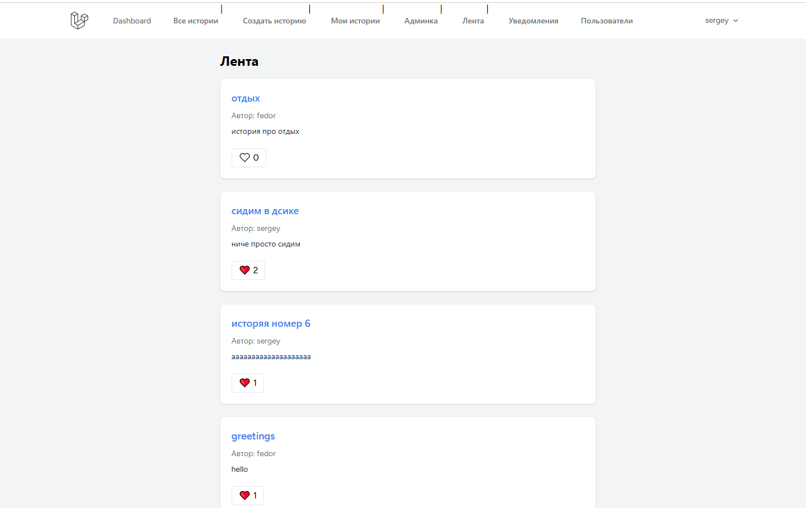

 Laravel Stories App

## Описание
Приложение для публикации историй с лайками, комментариями, подписками и уведомлениями.

---

## 🚀 Функционал

- Аутентификация (регистрация / логин)
- CRUD историй
- Теги
- Лайки (AJAX)
- Комментарии и ответы (nested)
- Подписки на пользователей
- Персонализированная лента (feed)
- Уведомления (Laravel Notifications)
- Админ-панель (модерация историй)

---

## 🛠 Стек

- Laravel
- MySQL
- Blade
- Tailwind CSS
- JavaScript (Fetch API / AJAX)

---

## ⚙️ Установка

```bash
git clone https://github.com/barabanq/laravel-stories-app.git
cd laravel-stories-app

composer install
npm install

cp .env.example .env
php artisan key:generate

# настрой базу данных в .env
php artisan migrate

npm run dev
php artisan serve 

```

## 👑 Админ

php artisan tinker
$user = App\Models\User::find(1);
$user->is_admin = true;
$user->save();

##  Скриншоты

### Лента историй


### Модерация историй


### Все истории и поиск


### Мои истории
