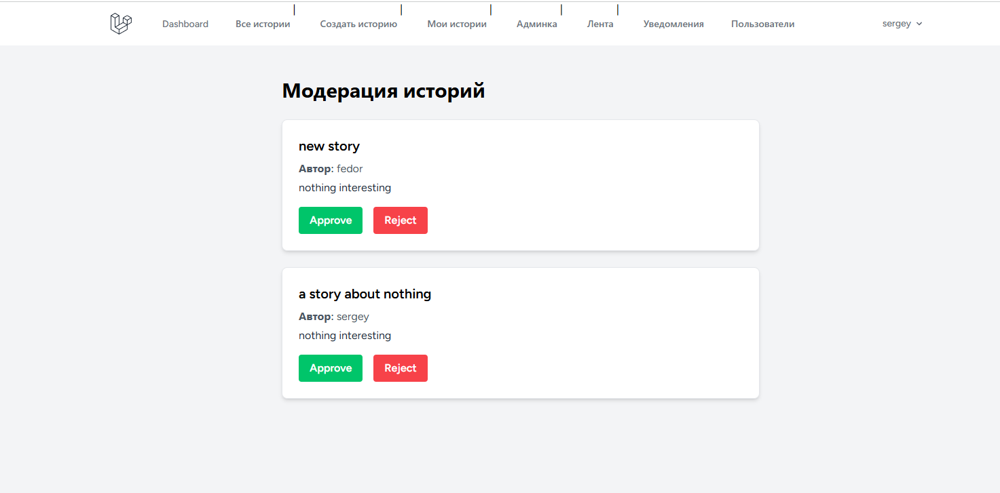
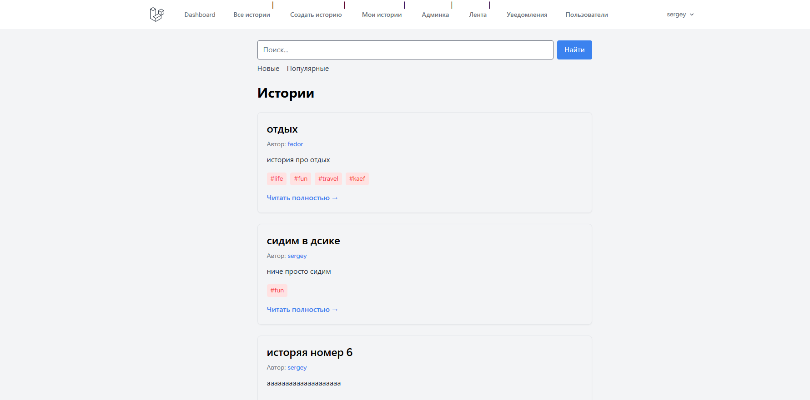
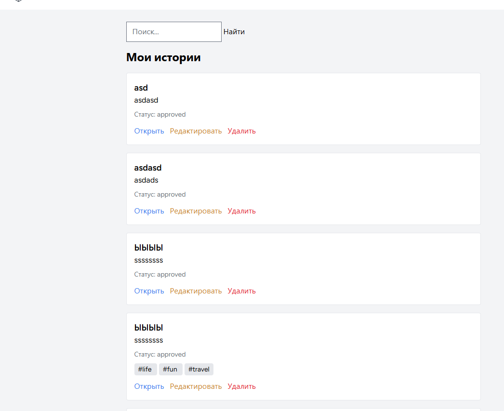

    Laravel Stories App

    ## Описание
    Приложение для публикации историй с лайками, комментариями, подписками и уведомлениями.

    ---

    ## 🚀 Функционал

    - Аутентификация (регистрация / логин)
    - CRUD историй
    - Теги
    - Лайки (AJAX)
    - Комментарии и ответы (nested)
    - Подписки на пользователей
    - Персонализированная лента (feed)
    - Уведомления (Laravel Notifications)
    - Админ-панель (модерация историй)

    ---

    ## 🛠 Стек

    - Laravel
    - MySQL
    - Blade
    - Tailwind CSS
    - JavaScript (Fetch API / AJAX)
    - Docker + Docker Compose
    - Nginx

    ---

    ## ⚙️ Установка

    ```bash
    git clone https://github.com/barabanq/laravel-stories-app.git
    cd laravel-stories-app

    # Собираем и запускаем контейнеры
    docker-compose up --build -d

    # Зайти в контейнер PHP
    docker-compose exec app bash

    # Скопировать .env
    cp .env.example .env

    # Сгенерировать ключ приложения
    php artisan key:generate

    # Настроить базу данных в .env (DB_HOST=db, DB_DATABASE=laravel, DB_USERNAME=root, DB_PASSWORD=secret)

    # Применить миграции
    php artisan migrate

    # Собрать фронтенд через Vite
    npm install
    npm run build

    # Открыть проект в браузере
    http://localhost:8080
    ```
    

    ## 👑 Админ

    docker-compose exec app php artisan tinker
    $user = App\Models\User::find(1);
    $user->is_admin = true;
    $user->save();

    ##  Скриншоты

    ### Лента историй
    

    ### Модерация историй
    

    ### Все истории и поиск
    

    ### Мои истории
    